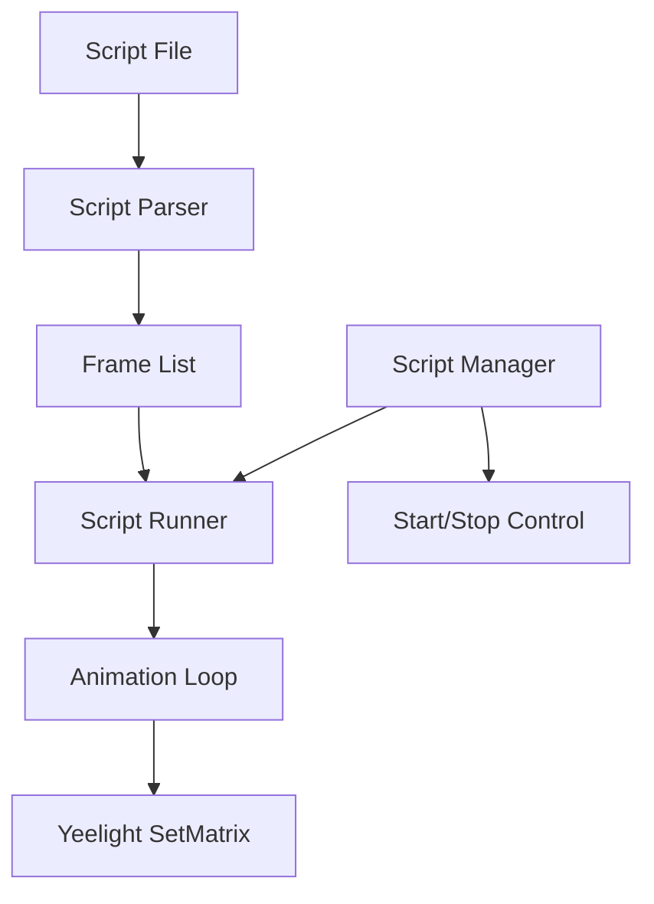

# Yeelight Cube Script Language Design

## Overview
A simple, mnemonic scripting language for controlling a 5x5 LED matrix on one face of the Yeelight cube. Each line represents one frame/state, and scripts can be static or animated.

## Language Syntax

### Basic Commands

#### Color Commands
- `FILL <color>` - Fill entire matrix with color
- `CLEAR` - Clear matrix (same as FILL black)
- `PIXEL <x> <y> <color>` - Set single pixel at coordinates (0-4, 0-4)
- `ROW <row> <color>` - Fill entire row (0-4)
- `COL <col> <color>` - Fill entire column (0-4)

#### Pattern Commands
- `CIRCLE <x> <y> <radius> <color>` - Draw circle centered at x,y
- `RECT <x1> <y1> <x2> <y2> <color>` - Draw filled rectangle
- `LINE <x1> <y1> <x2> <y2> <color>` - Draw line between points
- `CROSS <x> <y> <size> <color>` - Draw cross/plus pattern
- `RING <x> <y> <radius> <color>` - Draw ring (hollow circle)

#### Animation Helpers
- `ROTATE <degrees>` - Rotate current matrix by degrees (90, 180, 270)
- `SHIFT <direction>` - Shift matrix (UP, DOWN, LEFT, RIGHT)
- `DIM <factor>` - Dim all colors by factor (0.0-1.0)

### Color Notation
Colors can be specified as:
- Hex: `#FF0000` or `FF0000`
- Named: `red`, `green`, `blue`, `white`, `yellow`, `cyan`, `magenta`, `orange`, `purple`, `black`

### Example Scripts

#### spinner.txt (animated spinner - rotating dot around the edge)
```
CLEAR
PIXEL 2 0 white

CLEAR
PIXEL 3 0 white
PIXEL 3 1 white

CLEAR
PIXEL 4 2 white

CLEAR
PIXEL 3 3 white
PIXEL 3 4 white

CLEAR
PIXEL 2 4 white

CLEAR
PIXEL 1 3 white
PIXEL 1 4 white

CLEAR
PIXEL 0 2 white

CLEAR
PIXEL 1 1 white
PIXEL 1 0 white
```

#### green.txt (static green circle)
```
CIRCLE 2 2 2 green
```

#### pulse.txt (pulsing center dot)
```
CLEAR
PIXEL 2 2 white

CLEAR
PIXEL 2 2 white
RING 2 2 1 white

CLEAR
PIXEL 2 2 white
RING 2 2 1 white
RING 2 2 2 white

CLEAR
RING 2 2 1 white
RING 2 2 2 white

CLEAR
RING 2 2 2 white

CLEAR
```

#### wave.txt (horizontal wave effect)
```
COL 0 blue

COL 1 blue
COL 0 cyan

COL 2 blue
COL 1 cyan
COL 0 white

COL 3 blue
COL 2 cyan
COL 1 white
CLEAR

COL 4 blue
COL 3 cyan
COL 2 white
COL 1 cyan
COL 0 blue

COL 4 cyan
COL 3 white
COL 2 cyan
COL 1 blue

COL 4 white
COL 3 cyan
COL 2 blue

COL 4 cyan
COL 3 blue

COL 4 blue

CLEAR
```

#### cross.txt (animated cross pattern)
```
CLEAR
CROSS 2 2 1 red

CLEAR
CROSS 2 2 2 red

CLEAR
CROSS 2 2 1 orange
CROSS 2 2 2 red

CLEAR
CROSS 2 2 1 yellow
CROSS 2 2 2 orange

CLEAR
CROSS 2 2 1 green
CROSS 2 2 2 yellow

CLEAR
CROSS 2 2 1 blue
CROSS 2 2 2 green

CLEAR
CROSS 2 2 2 blue

CLEAR
```

#### checkerboard.txt (static checkerboard pattern)
```
PIXEL 0 0 white
PIXEL 2 0 white
PIXEL 4 0 white
PIXEL 1 1 white
PIXEL 3 1 white
PIXEL 0 2 white
PIXEL 2 2 white
PIXEL 4 2 white
PIXEL 1 3 white
PIXEL 3 3 white
PIXEL 0 4 white
PIXEL 2 4 white
PIXEL 4 4 white
```

#### slide.txt (sliding line animation)
```
ROW 0 magenta

ROW 1 magenta
ROW 0 purple

ROW 2 magenta
ROW 1 purple

ROW 3 magenta
ROW 2 purple

ROW 4 magenta
ROW 3 purple

ROW 4 purple

CLEAR
```

#### corners.txt (blinking corners)
```
CLEAR
PIXEL 0 0 yellow
PIXEL 4 0 yellow
PIXEL 0 4 yellow
PIXEL 4 4 yellow

CLEAR

CLEAR
PIXEL 0 0 yellow
PIXEL 4 0 yellow
PIXEL 0 4 yellow
PIXEL 4 4 yellow

CLEAR
```

#### rotate_square.txt (rotating square using ROTATE command)
```
RECT 1 1 3 3 cyan

ROTATE 90

ROTATE 90

ROTATE 90

CLEAR
```

#### fade.txt (fading effect using DIM)
```
FILL white

DIM 0.8

DIM 0.6

DIM 0.4

DIM 0.2

CLEAR
```

## Implementation Architecture



## API Design

```go
// Script represents a parsed script
type Script struct {
    Name   string
    Frames []ColorMatrix
}

// ScriptRunner manages script execution
type ScriptRunner struct {
    yeelight     *Yeelight
    currentScript *Script
    stopChan     chan bool
    interval     time.Duration
    timeout      time.Duration
}

// Main functions
func ParseScript(filename string) (*Script, error)
func (sr *ScriptRunner) RunScript(scriptName string, interval, timeout time.Duration) error
func (sr *ScriptRunner) StopScript() error
```

## Usage Example

```go
runner := NewScriptRunner(yl)

// Run animated script with 500ms between frames, no timeout
runner.RunScript("spinner.txt", 500*time.Millisecond, 0)

// Run static script (no interval means static)
runner.RunScript("green.txt", 0, 0)

// Stop current script
runner.StopScript()